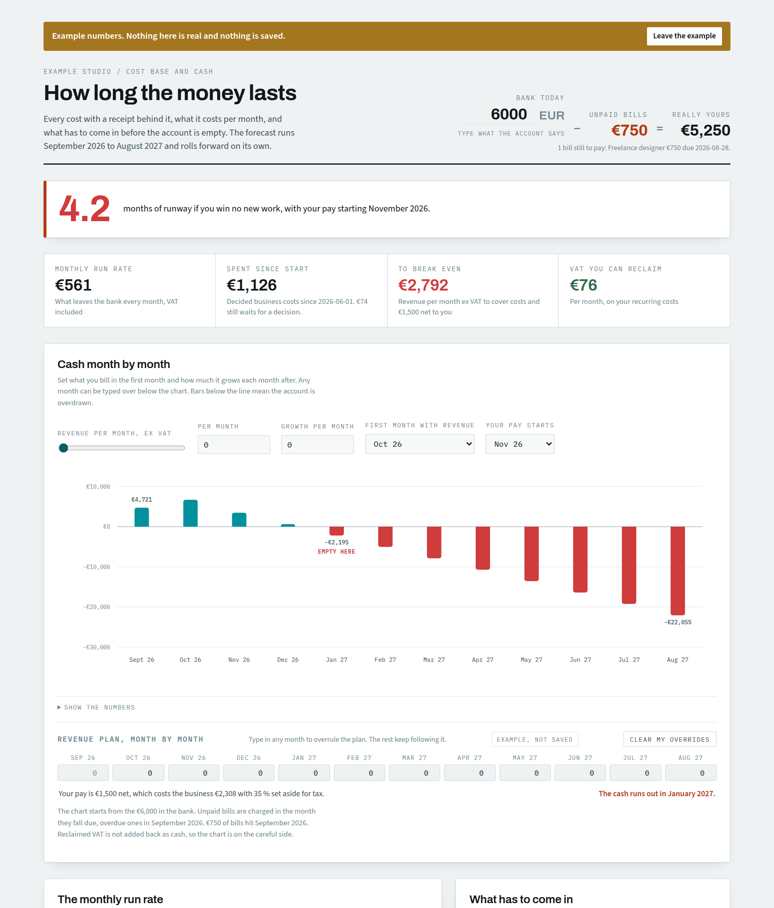

# Business Runway, a Claude artifact

A free Claude artifact that tells you how many months your business can run on the money in the bank. Cash flow forecast, burn rate, break even and receipt tracking in one page, set up by Claude in about 10 minutes.

Made by [Brinvik](https://www.brinvik.com).

⭐ **If it helps you, star the repo.** It is how other founders find it.

I built the first version for my own company. This is the clean template. No data in it.

## What you get

- **Months of runway.** How long the cash lasts if nothing comes in.
- **Cash month by month.** Twelve months ahead. Type what you expect to bill and watch the month you run dry move.
- **Break even.** What you have to invoice each month to cover costs and pay yourself.
- **Before you buy it.** Test a laptop, a tool or a hire before you commit.
- **Receipts in one place.** Claude pulls invoices from your email and reads photos of paper receipts. You click Business or Private on the ones it is unsure about.
- **Bills to pay.** Overdue and upcoming, so nothing surprises you.
- **Money owed to you.** Invoices you sent that are not paid yet, placed in the month you expect the cash.
- **Gmail to Drive script.** Optional. Saves invoices from Gmail into Drive by month, and sorts phone photos of receipts.

It works in any currency.

## Who it is for

Solo founders, consultants and small teams who want a clear picture of their cash without learning accounting software.

## Two ways to set it up

Both take about 10 minutes. You click through a few rounds of questions, type your numbers once, and Claude fills in the page.

### Pro, Max, Team or Enterprise: Claude builds it for you

Works in Claude Cowork and Claude Code. Your data is saved in your Claude account, and Claude updates the page directly.

1. **Download** `business-runway-skill.zip`.
2. **Add the skill.** In Claude go to Customize, then Skills. Press +, then Upload a skill, and pick the zip. Code execution must be on.
3. **Say** "set up my business runway". Claude loads /dataviz, asks its questions and publishes your private page.

Using Claude Code? Unzip the file into your skills folder instead, `%USERPROFILE%\.claude\skills` on Windows.

### Free plan

1. **Download** `business-runway-skill.zip` and `business-runway.html`.
2. **Add the skill** the same way as above. Can't add skills? Paste the text from `SETUP-PROMPT.md` into a new chat and attach the HTML file instead.
3. **Say** "set up my business runway". Claude asks its questions, then either publishes your page or tells you to open the HTML file in Chrome or Edge.
4. **Import.** Claude gives you a file. On the page, go to Your data, pick the file and press Import now.

Opened the HTML file yourself? Then your numbers are saved in that browser only. Download a backup now and then.

Later, say "update my runway" in Claude. On the Free route, press Copy the short version for Claude first and paste it into the chat.

Want to look before you set anything up? Open the page and press **Show it with example numbers**.

## Your data

- Your copy is private. Only you can open it unless you share it.
- On Pro and up, receipts are stored in your artifact's own database inside your Claude account. On the Free route, they stay in your own browser. Nothing goes to Brinvik or to this repo.
- Claude reads your email only when you ask it to and only for invoices.
- On the Free route, anyone who uses your computer account and browser can open the page and see the numbers. Use your own browser profile, and do not open HTML files from people you do not trust in the same browser.
- **Do not share the link to your own copy.** Anyone you share it with can see and change your receipts.
- The setup prompt tells Claude to leave out card numbers, bank account numbers and ID numbers. Check the first import yourself.
- The page uses Google Fonts, so Google sees your IP address when the page opens. Prefer not? Tell Claude "use system fonts for my runway page" and it removes them.

## Good to know

- It is a planning tool, not bookkeeping. Keep your accounting system and ask your accountant about tax.
- Exchange rates are the ones you give it. Update them now and then in Settings.
- Photo receipts come in when you ask Claude to update. The page does not watch your folder on its own.
- The Gmail script saves attachments only. Receipts sent as plain email text need to be forwarded to Claude or saved as PDF.
- The Gmail script asks Google for full Gmail access. It has no code that sends, forwards or deletes mail. Read it before you run it, it is short.

## What is in this repo

| File | What it is |
|---|---|
| `business-runway-skill.zip` | The skill. Upload it to Claude and say "set up my business runway". Unzip it first if you want to read it. |
| `business-runway.html` | The page. Claude publishes your private copy, or you open it in your browser. |
| `SETUP-PROMPT.md` | The same setup as a prompt, for when you cannot add skills. |
| `receipts-to-drive.gs` | Optional Google Apps Script that saves receipts from Gmail into Google Drive. |
| `tests/` | Automated checks for the page and the script. Only needed if you change the code. |
| `screenshot.png`, `screenshot-mobile.png` | The page in example mode. |

## Videos

- What it is and what you get (coming soon)
- Setting it up in 10 minutes (coming soon)

## Made by

Kim Olsen, [Brinvik](https://brinvik.com). I help companies get more out of Claude.

Found a bug or have an idea? Open an issue. And if the page saved you a spreadsheet, a star helps others find it.

MIT license. Use it, change it, share it. See `LICENSE`.

The license covers the code and the guide. It does not cover the Brinvik name or logo. You can use and rebrand the template freely, but do not present your version as made or endorsed by Brinvik.
